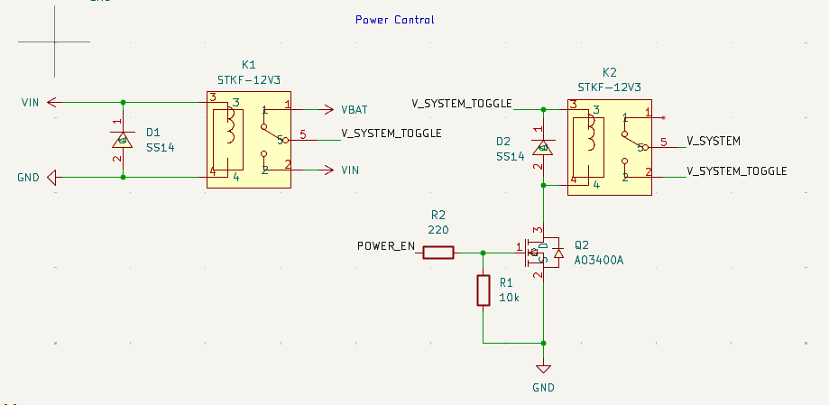
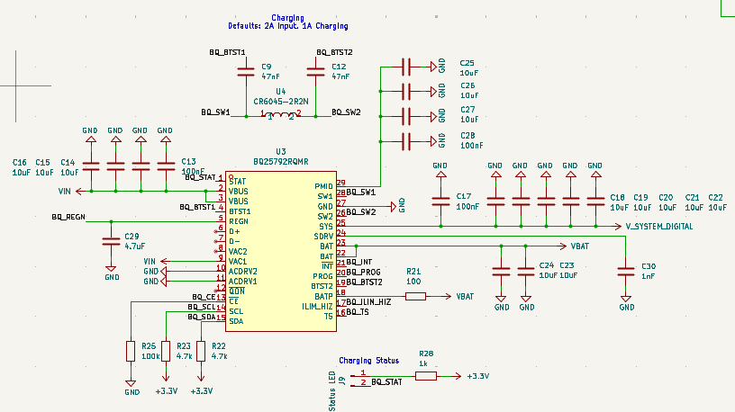
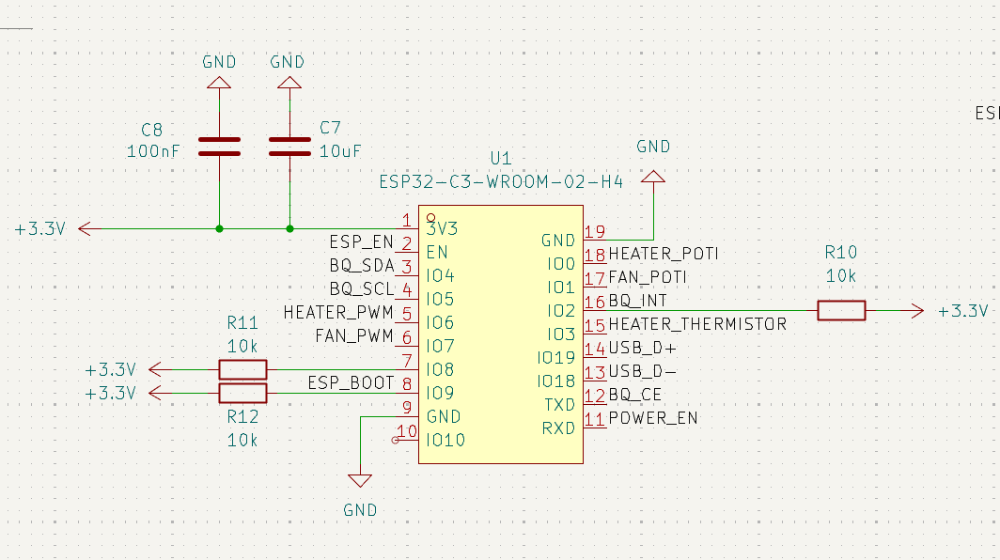
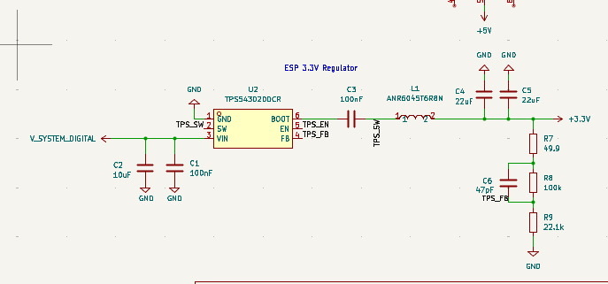
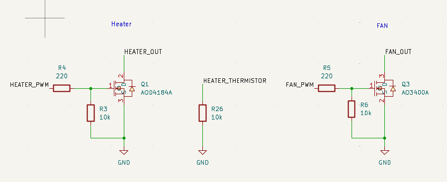
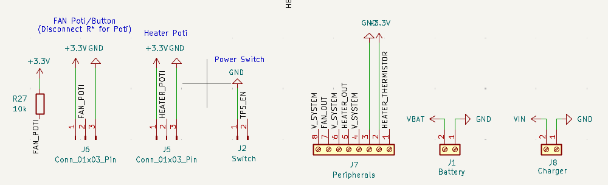

# Car seat control (ESP32-C3 / PlatformIO)

Firmware for a DIY car-seat control unit with heating/cooling and battery charging integration.

## Status

- Hardware/feature intent is documented below.
- Current firmware in [src/main.cpp](src/main.cpp) is still the PlatformIO template (no seat-control logic yet).

## What this is (intended)

The overall project is a car seat with:

- Electrical adjustment motors (not handled by this firmware)
- Seat heating and cooling
- A custom battery pack
- A charging module that the ESP32 talks to

This firmware is intended to run on an ESP32-C3 (configured for the Adafruit QT Py ESP32-C3 in [platformio.ini](platformio.ini)).

## Planned functionality

### Heating & cooling control

- A potentiometer provides the user setpoint/input.
- The ESP32 drives heating and cooling via PWM outputs.
- A dedicated “kill/enable” output can disable both heating and cooling.
- Heating also reads a thermistor input; the firmware must enforce temperature safety limits to avoid damage.

### Charging module integration

- Communication with the charging module via I2C.
- An interrupt line from the module to the ESP32 signals events (e.g., charger plugged in).
- An ESP32 output can disable/stop charging (if needed).

### Optional WiFi

- The ESP32 may try to connect to a configured WiFi for monitoring/control.
- WiFi should be power-aware; if it drains too much battery it may be disabled.

## Hardware

This repo contains both firmware and a custom-hardware design.

- Firmware is currently configured for an Adafruit QT Py ESP32-C3 (`adafruit_qtpy_esp32c3` in [platformio.ini](platformio.ini)).
- The KiCad design in [assets/schematics/chris/](assets/schematics/chris/) uses an ESP32-C3 module directly (ESP32-C3-WROOM-02-H4).

### Schematics (screenshots)

These images are exported from the KiCad project and are useful for quickly understanding the blocks:

### Key parts (from the order list)

The order list is in [assets/order/export_cart_20260301_180926.csv](assets/order/export_cart_20260301_180926.csv).

Notable parts from that cart export:

- ESP32 module: ESP32-C3-WROOM-02-H4 (LCSC C2944070), qty 2
- Charger IC: BQ25792RQMR (LCSC C2862876), qty 2 (1–4 cell, up to 5A charger IC)
- Automotive relays: STKF-12V3 (LCSC C771768), qty 10 (12V coil, 15A@14VDC contacts)
- Power MOSFETs: AOD4184A (LCSC C99124), qty 5 (TO-252 / DPAK)
- Small MOSFETs: AO3400A (LCSC C347475), qty 20 (SOT-23)
- Schottky diodes: SS54F (LCSC C5359893), qty 20 (40V / 5A)
- Inductors: CR6045-2R2N (LCSC C7588804), qty 10 (2.2µH)
- NTC thermistor: HNTC-103F3435FA (LCSC C52204610), qty 10 (10k NTC)
- Terminal blocks: MX142R-5.08-08P (LCSC C48688013), qty 1; MX142R-5.08-02P (LCSC C48688007), qty 5

### Signals / nets (as named in the schematic)

If you want the firmware pinout to match the PCB, these are the key named nets to map to ESP32-C3 GPIOs:

- Heater: `HEATER_PWM`, `HEATER_OUT`, `HEATER_POTI`, `HEATER_THERMISTOR`
- Fan/cooling: `FAN_PWM`, `FAN_OUT`, `FAN_POTI`
- Charger (BQ25792): `BQ_SDA`, `BQ_SCL`, `BQ_INT`, `BQ_STAT`, `BQ_CE`, `BQ_ILIM_HIZ`, `BQ_TS`
- Power control: `POWER_EN`, `V_SYSTEM`, `V_SYSTEM_TOGGLE`
- ESP control: `ESP_EN`, `ESP_BOOT`

## Pinout / wiring (from KiCad schematic)

The KiCad schematic places net labels directly on the ESP32-C3 module pins (U1). Based on those labels, the mapping is:

- Heater
	- `HEATER_PWM` -> ESP32-C3 `IO7`
	- `HEATER_POTI` -> ESP32-C3 `TXD`
	- `HEATER_THERMISTOR` -> ESP32-C3 `IO3`

- Fan / cooling
	- `FAN_PWM` -> ESP32-C3 `IO6`
	- `FAN_POTI` -> ESP32-C3 `IO18`

- Charger (BQ25792)
	- `BQ_SDA` -> ESP32-C3 `IO9`
	- `BQ_SCL` -> ESP32-C3 `IO8`
	- `BQ_INT` -> ESP32-C3 `IO19`
	- `BQ_CE` -> ESP32-C3 `IO0`

- USB (debug / flashing)
	- `USB_D+` -> ESP32-C3 `IO2`
	- `USB_D-` -> ESP32-C3 `IO1`

- Boot control
	- `ESP_BOOT` -> ESP32-C3 `IO4`

Notes:

- The schematic also labels `ESP_EN` and `POWER_EN` at pins that are currently named `GND` in the ESP32-C3 symbol. Please verify the custom symbol pinout and/or those net labels before relying on that part of the mapping.

## Build, flash, monitor

Prerequisites:

- PlatformIO (VS Code extension or `pio` CLI)

Commands (from repo root):

- Build: `pio run`
- Upload: `pio run -t upload`
- Serial monitor: `pio device monitor`

If you have multiple serial devices connected, specify the port:

- `pio run -t upload --upload-port /dev/ttyUSB0`
- `pio device monitor --port /dev/ttyUSB0`

## Configuration

TBD:

- WiFi credentials/config mechanism (compile-time constants? `secrets.h`? captive portal?)
- Temperature limits and PWM frequency
- Charging-module parameters (I2C address, thresholds)

## Safety notes

- Seat heaters can overheat if driven blindly; the thermistor should always be enforced with conservative limits.
- Add an independent hardware fuse / cutoff where appropriate; do not rely purely on firmware for safety.

## Roadmap

- Implement PWM outputs for heating/cooling
- Implement potentiometer input + mapping to PWM
- Add thermistor reading + overtemp protection
- Add I2C driver for the charging module + interrupt handling
- Decide whether WiFi is worth the power cost

## License

TBD
